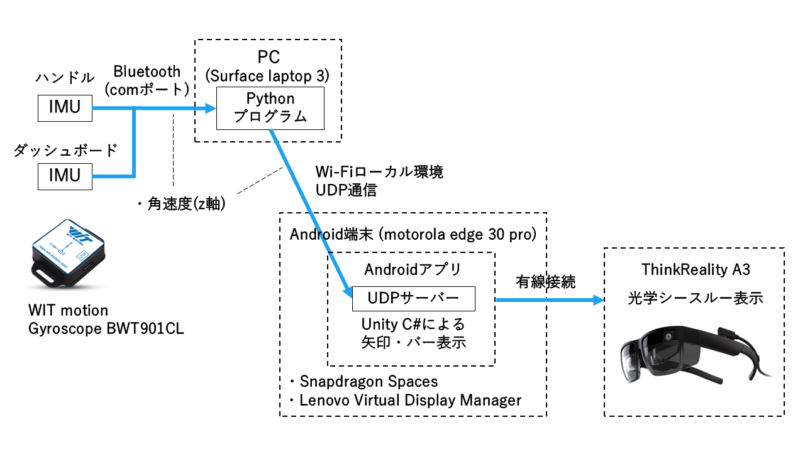

# AR-MotionSickness-Reduction-Research
This repository contains materials related to the study "An Investigation of AR-Based Indication Methods for Future and Current Car Directions and Their Effects on Motion Sickness Reduction."

## 構成
- sensor_program : センサープログラム
  - class_bwt901cl.py : bwt901clからデータを受信する関数が定義されている．
  - bwt901cl_2sensor.py : class_bwt901cl.pyを利用する．2つのセンサーからデータを受信して，unityアプリに送信し，csvに出力する．

- bar_glow_system_Scripts : 手法3のunityファイルのScripts部分のみ
  - UDPReceiver.cs : データを受け取り,受信キューに入れた順にデータを処理させる．
  - DataProcessor.cs : データを変数に格納し，表示に反映させる．
  - CSVWriter.cs : csvに書き込む．

- mssq.py : MCCQ値を計算する

## 使い方
IMUセンサーとPCをBluetooth接続した状態で，bwt901cl_2sensor.pyを実行すると，センサーからデータを受信できる．UDP_IPには，unityプログラムを実行する端末のIPv4アドレスを調べて代入する．port番号はbwt901cl_2sensor.pyとUDPReceiver.csで一致させる．bwt901cl_2sensor.pyを実行している間，unityプログラムを実行させると，unityプログラムにデータが受信され，表示に反映させる．

## データ処理の流れ

